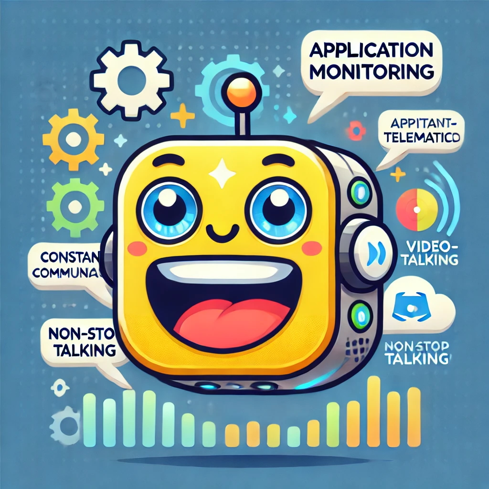

# Tagarela

#  Discord Monitor Bot

🚀 **Discord Monitor Bot** é uma aplicação open source construída em NodeJS e Express que permite o envio de mensagens para um canal específico no Discord através de um endpoint `/send`. O objetivo deste projeto é simplificar o processo de integração com o Discord, facilitando a comunicação de eventos e alertas diretamente em um canal configurado.

## 📜 Funcionalidades

- Envia mensagens para um canal no Discord via webhook
- Fácil integração com outros sistemas através de um simples POST no endpoint `/send`
- Configuração rápida e direta de um webhook no Discord

## 🛠️ Tecnologias

- NodeJS
- Express
- Discord Webhooks

## 📦 Instalação

1. Clone este repositório:

   ```bash
   git clone https://github.com/username/tagarela.git
   cd tagarela
   ```

2. Instale as dependências:

   ```bash
   pnpm install
   ```

3. Configure as variáveis de ambiente no arquivo `.env`:

   ```env
   DISCORD_WEBHOOK_URL=your_webhook_url_here
   TAGARELA_SECRET=your_secret_api_key_here
   ```

4. Inicie a aplicação em modo de desenvolvimento:

   ```bash
   pnpm dev
   ```

5. Faça o build:

```bash
pnpm build
```

5. Inicie a aplicação:

```bash
pnpm start
```

A aplicação estará rodando em `http://localhost:3000`.

## 🚀 Fazendo o build da aplicação

A aplicação já está com o `Dockerfile` e o `docker-compose.yaml` devidamente configurados.

Para rodar o projeto no docker execute:

```bash
docker compose up --build
```

> Certifique-se que realizou a build do projeto.

## 🤖 Configure seu arquivo de testes

1. Renomeie o arquivo `test.example.sh` para `test.sh`
2. Adicione permissão

```bash
chmod +x .teste.sh
```

3. Incluia a sua `api-key`
4. Execute o teste

```bash
chmod +x .teste.sh
```

## 🚀 Como Usar

Envie uma requisição POST para o endpoint `/send` com o seguinte corpo:

```json
{
  "message": "Sua mensagem aqui"
}
```

### Exemplo usando `curl`:

```bash
curl -X POST http://localhost:3000/send -H "Content-Type: application/json" -H "api-key: XXX" -d '{"message": "Hello Discord!"}'
```

## 🔗 Criando um Webhook no Discord

1. Acesse seu servidor no Discord e selecione o canal onde deseja receber as mensagens.
2. Clique no ícone de configurações ao lado do canal e vá até a seção **Integrações**.
3. Clique em **Webhooks** e, em seguida, em **Criar Webhook**.
4. Configure o nome e a imagem do webhook, e copie a URL gerada.
5. Defina a variável `DISCORD_WEBHOOK_URL` no arquivo `.env` com a URL copiada.

## 🙌 Contribuições

Contribuições são bem-vindas! Siga os passos abaixo para colaborar:

1. Faça um fork do projeto.
2. Crie uma nova branch:
   ```bash
   git checkout -b feature/nova-feature
   ```
3. Faça suas alterações e adicione um commit:
   ```bash
   git commit -m 'Adiciona nova feature'
   ```
4. Envie as alterações:
   ```bash
   git push origin feature/nova-feature
   ```
5. Abra um Pull Request.

## 📝 Boas Práticas

- Mantenha o código bem documentado.
- Garanta que todos os testes passem antes de abrir um PR.
- Siga o padrão de código definido no projeto.
- Seja respeitoso e colaborativo na comunidade.

## 💬 Feedback

Se você tiver alguma sugestão ou feedback, sinta-se à vontade para abrir uma issue ou entrar em contato.

---

Feito com 💙 por [Diogo Cezar](https://github.com/diogocezar)
